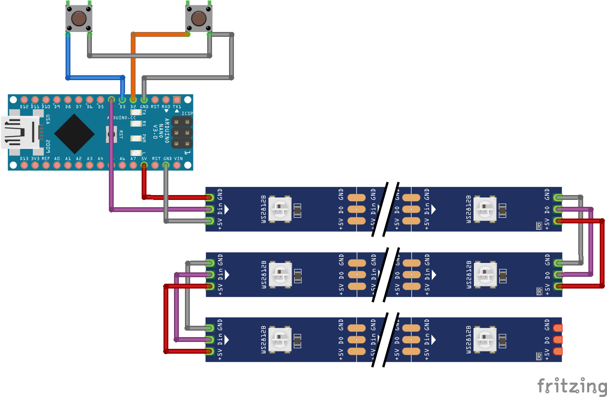

# Arduino LED Matrix
 

 An Arduino powered 16x16 LED Matrix using the [FastLED](http://fastled.io/) library to drive a WS2812B LED array.
## Wiring Diagram

## 3D Models

All models were created in [Tinkercad](https://www.tinkercad.com/) and exported in STL format.

- [Matrix Grid 1/4th - Side A](resources/models/LED_Matrix_4th_SideA.stl)
- [Matrix Grid 1/4th - Side B](resources/models/LED_Matrix_4th_SideB.stl)
- [Arduino Holder Base](resources/models/Nano_Holder_Base.stl)
- [Arduino Holder Lid](resources/models/Nano_Holder_Lid.stl)
  
## Materials List

| Part | Qty |   |
|---|---|---|
| Arduino Nano | 1 | https://www.amazon.com/gp/product/B07XVYBR9Y |
| WS2812B Strip Light - 60 LEDs, 5M | 1  | https://www.ebay.com/itm//264037239475 |
| 3 PIN Solderless LED Cable Connector For WS2812B WS2811 LED Strip Lamp 15cm  | 16  | https://www.ebay.com/itm/153661361028 |
| 12mm SPST NO Reset Switch Push Button | 2  | https://www.amazon.com/gp/product/B075VBWFM6 |
| Breadboard Jumper Wires | 7 | https://www.amazon.com/dp/B01EV70C78 |
| Black Wood Shadow Box - 12" x 12" | 1 | https://www.hobbylobby.com/Home-Decor-Frames/Frames-Photo-Albums/Shadow-Boxes-Display-Cases/Black-Wood-Shadow-Box---12%22-x-12%22/p/39376 |
| Creatology poser board plastic 22" x 28" | 1 | https://www.michaels.com/pacon-plastic-poster-board-clear/10378153.html |
| Elmers Foamboard 950109 20" x 30" x 3/16" | 1 | https://www.michaels.com/elmers-foam-board-white/10110205.html |
| Command Strip Mini Hooks (17006CLR-ES) | 2 | https://www.amazon.com/dp/B0084M67P8 |
| Electrical Tape | 1 | https://www.amazon.com/dp/B00004WCCL |

## Software & Other Resources

- Visual Studio Code - https://code.visualstudio.com/
- Arduino IDE - https://www.arduino.cc/en/Main/Software
- Ultimaker Cura - https://ultimaker.com/software/ultimaker-cura
- LCD Image Convertor - https://www.riuson.com/lcd-image-converter
- GIMP - https://www.gimp.org/
- Sprite Image Resources - https://www.spriters-resource.com/